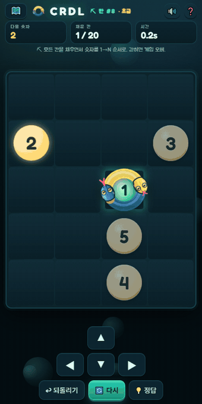

# 🐍 CRDL — 차례대로

> **숫자를 1 → N 순서대로!** 30년 전 모눈종이에 손으로 그렸던 격자 퍼즐을 모바일 게임으로 되살리는 프로젝트.
>
> *A grid puzzle where you snake through every cell, eating numbers strictly in order. Designed on graph paper 30 years ago — reborn as a mobile game.*

<p align="center">
  
</p>

<p align="center">
  
  
  
</p>

## 🎮 게임 방법

- 커서(뱀 머리)로 격자를 훑으며 숫자를 **1 → N 순서대로** 밟습니다.
- 상하좌우로만 이동, **지나간 칸(몸통)은 재통과 불가**.
- 길이 엉켜 갇히면 **게임 오버** — 스네이크의 액션성 + 퍼즐의 계획성.

| 장르 | 클리어 조건 | 난이도 |
|------|------------|--------|
| ⛏ **땅파기 (fill)** | 모든 칸을 채우면서 숫자를 순서대로 완성 | 어려움 — 해밀턴 경로 퍼즐 |
| ✏ **길잇기 (path)** | 숫자만 순서대로 이으면 됨 | 쉬움 |

## ▶ 바로 해보기

```
prototype/crdl.html 을 브라우저로 열기 — 설치 불필요, 파일 하나로 끝!
```

- **조작**: 옆 칸 탭 · 드래그 · 스와이프 · 방향키/WASD · 화면 D패드 (Z = 되돌리기)
- 튜토리얼 3판 → 스테이지 맵을 따라 점점 어려워지는 무한 스테이지
- 클리어하면 **수도꼭지가 하늘에서 떨어져 수돗물이 경로를 따라 콸콸** 흐릅니다 🚰

<p align="center">
  
</p>

## 🧩 레벨이 "항상 풀리는" 이유

정답을 먼저 만들고 숫자를 나중에 심습니다.

1. 지그재그 해밀턴 경로에서 출발
2. **backbite 연산**(경로 끝을 접어 뒤집기)으로 해밀턴 성질을 유지한 채 무작위화
3. 완성된 경로 위에 숫자 1..N을 순서대로 배치

→ 생성된 경로 자체가 정답이므로 모든 레벨의 **풀림이 보장**됩니다.

```bash
# 레벨 생성 (예: 8x6 격자, 숫자 1~10, 200개)
python tools/crdl_levelgen.py --rows 8 --cols 6 --numbers 10 --count 200 --out data/levels.json

# 생성기 자체 검증
python tools/crdl_levelgen.py --self-test
```

## 📁 구성

| 경로 | 설명 |
|------|------|
| `prototype/crdl.html` | 플레이 가능한 레퍼런스 구현 (단일 파일) |
| `tools/crdl_levelgen.py` | 항상 풀리는 레벨 생성기 |
| `tools/crdl_solver.py` | 패턴 솔버/검증기 |
| `data/levels.json` | 검증된 레벨 200개 (앱 번들용) |
| `CLAUDE.md` | 프로젝트 상세 안내 (규칙 · 데이터 형식 · 원리) |

## 🗺 로드맵

- [x] HTML 프로토타입 (마스코트 · 스테이지 맵 · 튜토리얼 · 클리어 연출)
- [x] 레벨 생성/검증 파이프라인 (Python)
- [ ] Flutter/Dart 앱 포팅 (앱 내 실시간 레벨 생성)
- [ ] 레벨 에디터 & 옛 모눈종이 패턴 사진 임포터
- [ ] 데일리 챌린지 · 테마 스킨
- [ ] Google Play 출시 → App Store 확장

## 📺 Build in Public

이 게임은 **개발 과정 자체를 콘텐츠로** 만드는 앱튜버 프로젝트의 첫 작품입니다.
30년 묵은 모눈종이 스케치가 앱이 되기까지의 여정을 기록합니다.

## 라이선스

TBD
